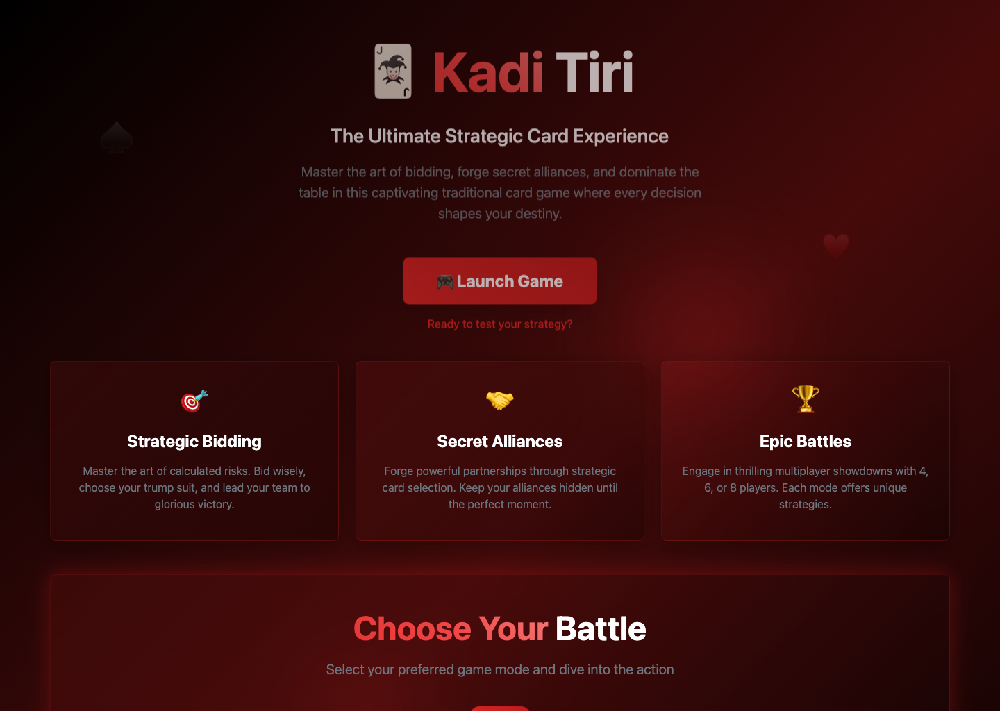
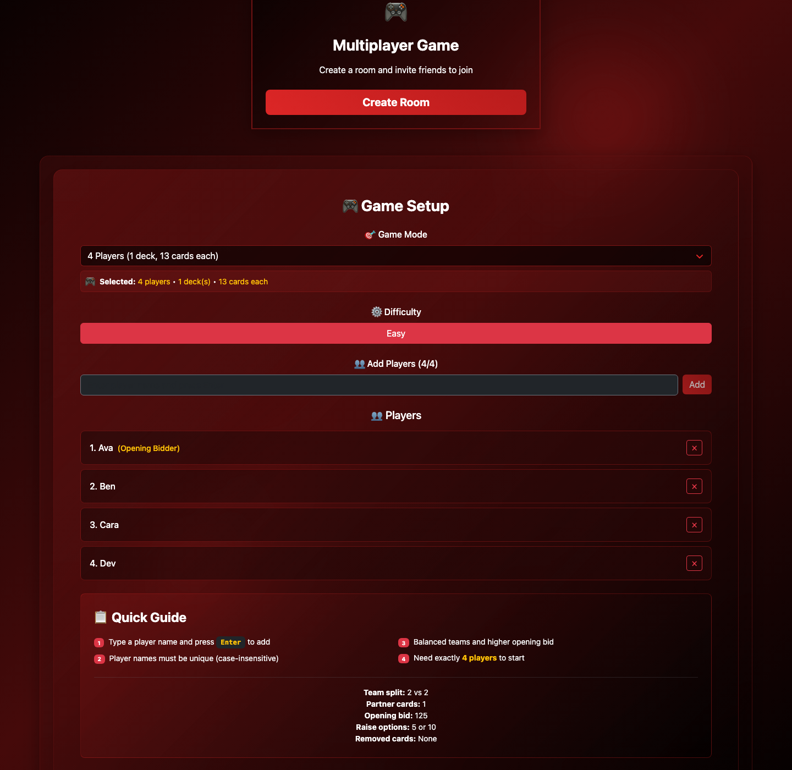
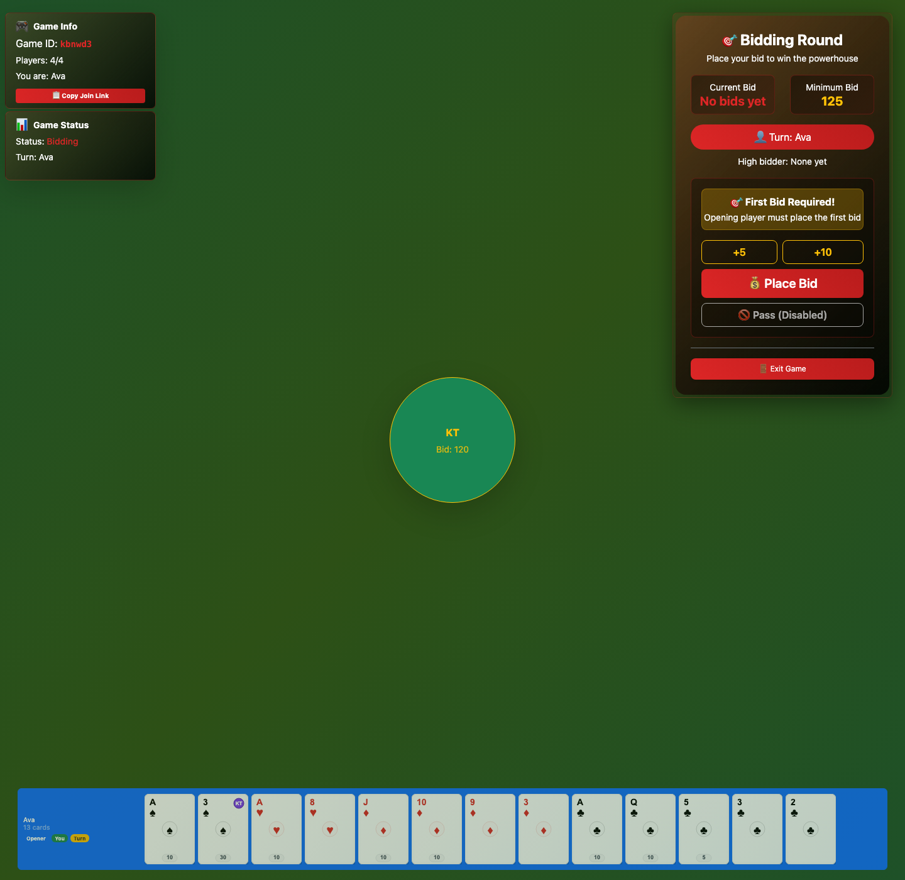

# Kadi Tiri Game

Kadi Tiri is a digital version of the traditional trick-taking card game also known as Kali Teeri.

This project is currently a web-based Next.js implementation with a playable game flow, room setup, bidding, partner selection, trick play, and end-of-round scoring.

## Screenshots





## Current Status

The project now follows the V2 rules model documented in [CHANGELOG.md](./CHANGELOG.md).

What is working now:
- game setup for `4`, `6`, and `8` players
- `Easy` / `Hard` difficulty support where applicable
- bidding with `+5` and `+10` raise options
- bid winner choosing `sir`
- partner card selection
- trick play with follow-suit enforcement
- bid-based result settlement
- Playwright E2E coverage for the 4-player prototype flow
- production build and TypeScript check
- server-owned room creation, join, and gameplay mutations

What is still prototype-level:
- browsers still sync by polling the Next.js API instead of real-time sockets
- the backend is still a Next.js prototype API, not a dedicated multiplayer game server
- long-term score history across multiple rounds is still limited

## Tech Stack

- Next.js
- React
- TypeScript
- Zustand
- Bootstrap

## Getting Started

### Requirements

- Node.js `18.18+`
- npm `10+`

This repo includes an `.nvmrc` file:

```bash
nvm use
```

### Install

```bash
npm install
```

### Run locally

```bash
npm run dev
```

Open:

```text
http://localhost:3000
```

### Useful commands

```bash
npm run type-check
npm run build
npm run test
npm run test:e2e
npm run test:e2e:headed
```

### End-to-end tests

The project now includes Playwright coverage for the local 4-player prototype flow.

Current E2E coverage:
- 4 players create/join a room, complete bidding and setup, and verify the first played card appears for every player
- 4 players complete one full trick and verify the trick closes and the next turn advances consistently
- long gameplay waits for turn consensus across all four browser pages before each automated move
- follow-suit enforcement when a player has the led suit
- rejection of off-turn card plays
- one full 4-player hand through finished-state scoring settlement

Important:
- Playwright must run on Node `18+`
- if your shell is still on Node `14`, switch first with `nvm use 18`
- local cross-browser room sync currently uses a `250ms` polling loop against the shared Next.js API

Backend note:
- room creation and room joins are now created on the server
- when the final player joins a waiting room, the server transitions directly into bidding
- bids, passes, powerhouse selection, partner selection, start-play, and card-play are all applied server-side

Run in headless mode:

```bash
npm run test:e2e
```

Run in headed mode:

```bash
npm run test:e2e:headed
```

## Game Rules

## Card Points

- `3♠` = `30`
- `A`, `K`, `Q`, `J`, `10` = `10`
- every `5` = `5`
- all other cards = `0`

## Trick Rules

- Players must follow the led suit if they have it.
- If a player does not have the led suit, they may play `sir`.
- If any `sir` card is played, the highest `sir` wins the trick.
- Otherwise, the highest card of the led suit wins the trick.
- `3♠` is not a universal trump by itself. It is only a high-point card unless spades is the chosen `sir`.

## Round Flow

1. Players join a room and choose a mode.
2. Bidding happens clockwise.
3. The winning bidder chooses `sir`.
4. The winning bidder selects partner card(s).
5. The winning bidder leads the first trick.
6. Teams collect trick points.
7. The round result is settled from the bid amount.

## Supported Modes

| Mode | Difficulty | Decks | Cards Per Player | Team Split | Partner Cards |
|---|---|---:|---:|---|---:|
| 4 players | Easy | 1 | 13 | 2 vs 2 | 1 |
| 6 players | Easy | 1 | 8 | 3 vs 3 | 2 |
| 6 players | Hard | 1 | 8 | 2 vs 4 | 1 |
| 6 players | Easy | 2 | 17 | 3 vs 3 | 2 |
| 6 players | Hard | 2 | 17 | 2 vs 4 | 1 |
| 8 players | Easy | 2 | 13 | 4 vs 4 | 3 |
| 8 players | Hard | 2 | 13 | 3 vs 5 | 2 |

## Bidding

- Opening bid depends on mode and difficulty.
- Players may raise by either `5` or `10`.
- The first opening bidder cannot pass before the first valid bid is placed.

Typical opening bids:

| Mode | Difficulty | Opening Bid | Max Bid |
|---|---|---:|---:|
| 4 players | Easy | 125 | 250 |
| 6 players, 1 deck | Easy | 125 | 250 |
| 6 players, 1 deck | Hard | 100 | 250 |
| 6 players, 2 decks | Easy | 250 | 500 |
| 6 players, 2 decks | Hard | 180 | 500 |
| 8 players | Easy | 250 | 500 |
| 8 players | Hard | 180 | 500 |

## Scoring

The game decides success or failure using actual trick points collected.

Recorded score uses the bid amount:

- if the bidding team wins:
  - bidder gets `2x` the bid
  - each partner gets `1x` the bid
- if the bidding team loses:
  - opposition players get the full bid amount

## Project Structure

```text
kadi-tiri-game/
├── src/
│   ├── components/
│   ├── hooks/
│   ├── pages/
│   ├── store/
│   ├── styles/
│   ├── types/
│   └── utils/
├── data/
├── CHANGELOG.md
├── package.json
└── README.MD
```

## Important Files

- `src/types/game.ts`
  - game types, supported modes, difficulty config
- `src/utils/gameUtils.ts`
  - card rules, bidding validation, trick winner logic, final scoring
- `src/store/gameStore.ts`
  - Zustand game flow and state transitions
- `src/components/game/*`
  - setup, bidding, partner selection, gameplay, result UI

## Known Limitations

- no server-authoritative multiplayer yet
- no persistent user accounts
- no real matchmaking
- no full multi-round score notebook yet

## Roadmap Direction

The next major steps are:

- proper round-to-round score tracking
- real multiplayer backend with server-authoritative actions
- removal of remaining prototype shortcuts
- mobile-oriented polish
- deeper tests for rules, trick resolution, and settlement

## Changelog

See [CHANGELOG.md](./CHANGELOG.md) for V2 rules and repo updates.

## Quick Repo Summary

- Purpose: Kadi Tiri is a digital version of the traditional trick-taking card game also known as Kali Teeri.
- Stack: Node.js, Next.js, React, TypeScript, PHP, JavaScript, Bootstrap
- Status confidence: high
- Pending: Remove client full-state persistence and fallback writes; Keep browser storage only for `playerId` and last joined `gameId`; Remove any endpoint that accepts full `gameState` writes from the client

## LLM Start Here
- `README.md`
- `graphify-out/GRAPH_REPORT.md`
- `Plan.md`
- `PLAN.md`
- `graphify-out/repo-semantic-summary.md`

## License

This repository is proprietary and released under [All Rights Reserved](LICENSE).
